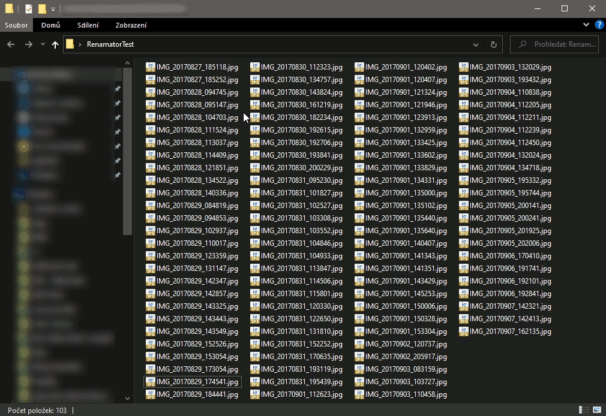

# Renamator

Renamator is simple utility for renaming files, especially photos and videos. It just renames long file names like *DSCF5413.jpg* or *P1180583.jpg* to easy-to-read *1.jpg*, *2.jpg* etc. The order of resulting numbers is determined by the trailing digits in the original file name. For example *2022DCSF***2039***.jpg* would be before *P**1435**.jpg*.

## Usage

Install Renamator using preferred installer of the [latest release](https://gitlab.com/Theobaldik/renamator/-/releases/permalink/latest). Then right click inside any folder containing files to rename and choose *Renumber Items*.

